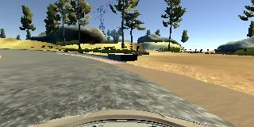
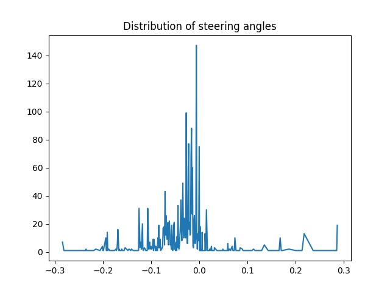
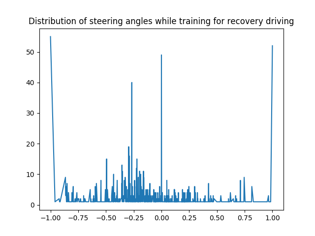

# Behaviorial Cloning Project

[](http://www.udacity.com/drive)

Overview
---

The goals of this project were the following:
* Use the simulator to collect data of good driving behavior
* Design, train and validate a model that predicts a steering angle from image data
* Use the model to drive the vehicle autonomously around the first track in the simulator
* Summarize the results in this written report

## My approach to the project

At first, I wanted to manually discover the tracks that are present in the simulator. I drove around the two tracks and noticed the following:

- the **first** track is, in terms of driving difficulty, fairly basic: there are no very sharp turns and no steep ascents or descents. Regarding the visuals, this track is well-lit and the road boundaries are clear. One of the difficulties may be that there are no lane lines.
- the **second** track is far more challenging, with sharp turns, steep hills, shadowy/dark areas. On of its advantages though is that there is a central line which divides the road. This might help drive the car autonomously as it can provide a high-level feature.

Since I had trouble even driving the second track manually, I decided to tackle the first track in the beginning, and if it goes well, train for the second.

### Collecting data

#### 1. Using Different Driving styles

Udacity provided a good dataset to start with, so I started off from that - but I also added to it.
For collecting data, first, I drove around the track three times very carefully, trying to drive as smoothly as I could. I recorded this as the basis of the training. Then, as it was suggested in the course, I recorded multiple attempts at '*correction driving*', when I pulled the car back to the center from the edge of the road. Then, as I was experiencing issues in autonomous mode around sandy corners (where there was no obvious curb), I started to collect more data around those areas (`curves_and_sandy_edges` folder).

The following two images represent two situations in which the position of the car is extreme, veering to the edge of the road, and the steering angle is large, to the opposite direction, so that the model learns that in these situations it should use a large angle to get back to the road.  




The following images describe the distribution of the steering angles in normal (smooth) driving session and in a `recovery`-driving style.






#### 2. Filtering and augmenting the dataset

For augmenting the dataset, I flipped each image horizontally, and changed the sign of the corresponding steering angle.
I decided to skip data points where the steering angle is `0` as I thought this to be not so relevant information - this turned out to quicken the training.


- I also found that resizing the images improves the speed of the training quite a lot - I resized images by a factor of `.5` in bulk, meaning that my model did not have to do it on the fly. This meant though that I had to modify `drive.py` so that it produces the resized image size - this can be seen in `drive_resized.py`.


### Working on the model architecture

Since I was sure that I wanted to crop the images so that they exclude the upper part (hills, trees, sky) and the lower part (hood of the car), I introduced a `2D cropping layer` at the beginning of the network. I then added a `normalizing Lambda layer` to normalize images.

Then, at first, I started experimenting with a very basic architecture: just one `Flatten` and one `Dense` layer, using `mse` of measuring loss and an `Adamoptimizer`.
It turned out to be usable, but not great. On the positive side, this was a very fast method of training, and since I have run out of AWS credits and I performed the training on my laptop, it was a great way of exploration.

Then, I started to add more layers to the network.

#### The final architecture

To have a reasonable time/accuracy ration, and since I did not have access to a GPU, I had to keep my model simple. While trying to keep it similar to the NVIDIA model, I've opted for the following architecture in the end:

```
Layer (type)                 Output Shape              Param #   
=================================================================
cropping2d_1 (Cropping2D)    (None, 50.0, 160.0, 3)    0         
_________________________________________________________________
lambda_1 (Lambda)            (None, 50, 160, 3)        0         
_________________________________________________________________
conv2d_1 (Conv2D)            (None, 46, 156, 6)        456       
_________________________________________________________________
max_pooling2d_1 (MaxPooling2 (None, 23, 78, 6)         0         
_________________________________________________________________
flatten_1 (Flatten)          (None, 10764)             0         
_________________________________________________________________
dense_1 (Dense)              (None, 16)                172240    
_________________________________________________________________
activation_1 (Activation)    (None, 16)                0         
_________________________________________________________________
dense_2 (Dense)              (None, 16)                272       
_________________________________________________________________
activation_2 (Activation)    (None, 16)                0         
_________________________________________________________________
dense_3 (Dense)              (None, 16)                272       
_________________________________________________________________
activation_3 (Activation)    (None, 16)                0         
_________________________________________________________________
dropout_1 (Dropout)          (None, 16)                0         
_________________________________________________________________
dense_4 (Dense)              (None, 1)                 17        
=================================================================
Total params: 173,257
Trainable params: 173,257
Non-trainable params: 0
_________________________________________________________________
```


### Caveats of the autonomous driving

For quite a long time I had trouble getting the car to drive autonomously, even though I had trained my model extensively. It had a validation loss of `0.0033`, but the car would just hit the curb and not follow the road. Since the training supposedly went well, and validation loss was very low, I figured it has to be some basic difference between the images I used for training and the images that are used for autonomous driving. After some research and Slack-channel exploration, it became suspicious that the training model and `drive.py` use different color channels: `BGR` and `RGB`, respectively. This would of course confuse the model as it '**sees**' totally different color during autonomous driving than during training. Switching the color channel of training images solved this issue.

I then found out that it is very important to teach the model how `not` to drive. Thus I gathered more training data around the extremes: when approaching the edge of the road, I swiftly steered to the opposite direction. I recorded several batches of this kind of behaviour. This turned out to be useful, as the model, even if it got to the edge, steered back to the road.


### Conclusion

The model used could benefit from some more training data and more layers.

It would be ideal if I could use a high-end GPU for training the model.
